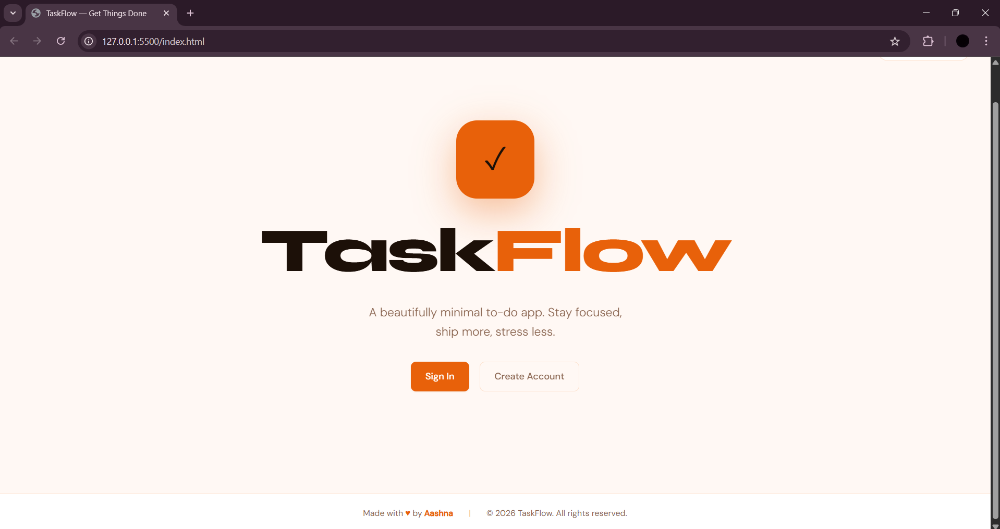
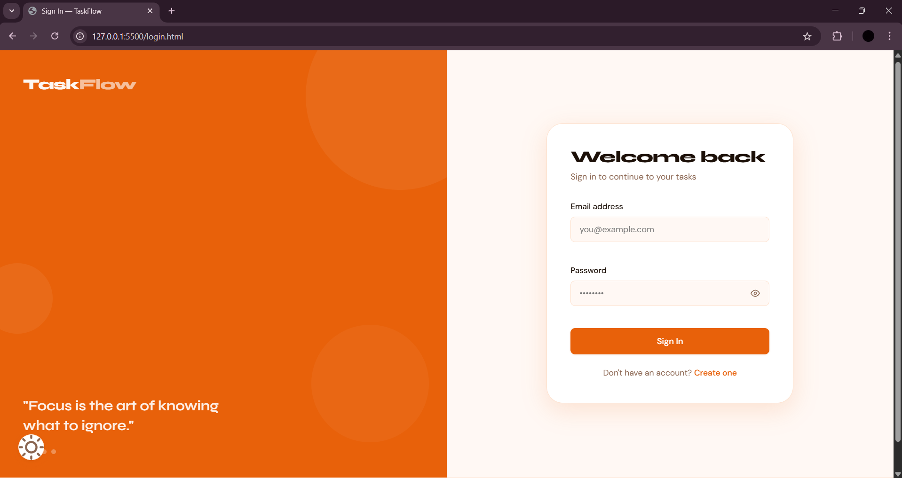
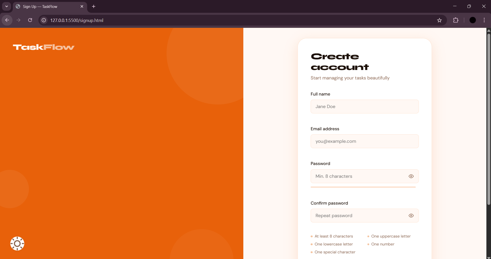
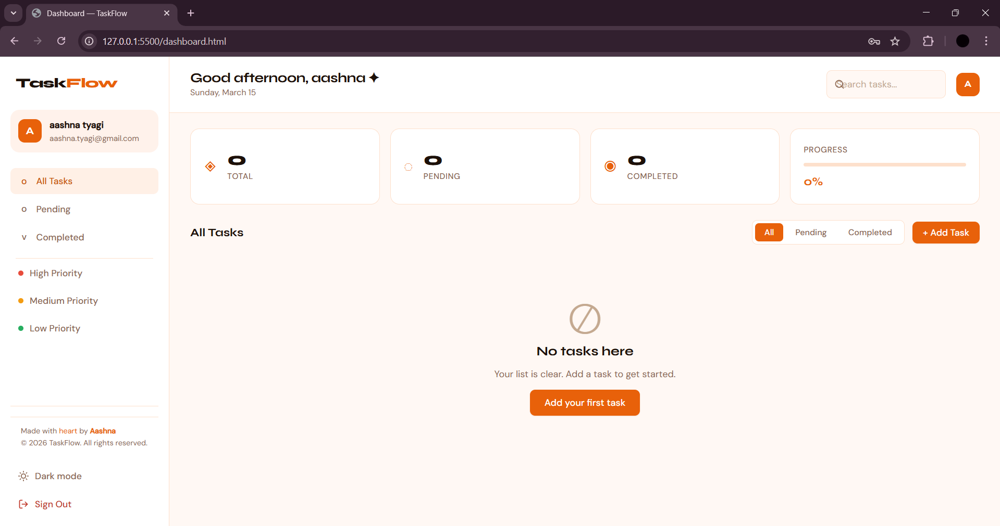
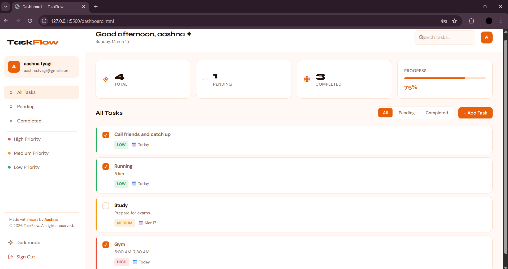
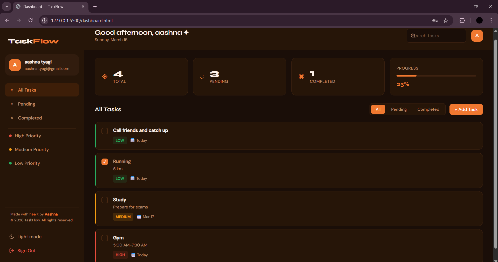

# TaskFlow ✓



> A production-grade, fully client-side To-Do List web application built with pure HTML5, CSS3, and Vanilla JavaScript. No frameworks. No backend. No dependencies. Just clean, professional code.

**Made with ♥ by Aashna** &nbsp;|&nbsp; © 2026 TaskFlow. All rights reserved.


---

## 📸 Screenshots

| Page | Preview |
|------|---------|
| 🏠 Landing Page |  |
| 🔐 Login |  |
| 📝 Sign Up |  |
| 📋 Dashboard |  |
| ➕ Add Task |  |
| 🌙 Dark Mode |  |

---

## 📁 Project Structure
```
todo/
├── index.html                  ← Landing / splash page
├── login.html                  ← Sign in page
├── signup.html                 ← Create account page
├── dashboard.html              ← Main app dashboard
├── README.md                   ← Project documentation
│
├── css/
│   └── style.css               ← Complete design system (CSS variables, 
│                                  components, animations, dark mode, responsive)
│
├── js/
│   ├── app.js                  ← Shared utilities (dark mode, toasts, helpers)
│   ├── auth.js                 ← Authentication (signup, login, session)
│   └── tasks.js                ← Task CRUD, filtering, sorting, rendering
│
└── screenshots/
    ├── 01_landing.png
    ├── 02_login.png
    ├── 03_signup.png
    ├── 04_dashboard.png
    ├── 05_add_task.png
    └── 06_dark_mode.png
```

---

## ✨ Features

### 🔐 Authentication System
- Secure **Sign Up** with full field validation — name, email, password, confirm password
- **Live password strength meter** with 5 levels — Weak · Fair · Good · Strong · Excellent
- **Password policy enforcement** — minimum 8 characters, uppercase, lowercase, number, special character
- **Login** validates credentials against localStorage-stored users
- **Session persistence** — users remain logged in across browser refreshes and tabs
- **Route guards** — unauthenticated users are redirected to login; authenticated users skip auth pages
- **Secure sign out** — clears session and redirects to login

### ✅ Task Management
| Feature | Description |
|---|---|
| **Add Tasks** | Title (required), description, priority level, optional due date |
| **Edit Tasks** | Full in-place editing via a pre-filled modal |
| **Delete Tasks** | Soft-confirm deletion modal to prevent accidental data loss |
| **Complete Tasks** | Toggle checkbox — strikethrough styling when completed |
| **Priority Levels** | 🔴 High · 🟡 Medium · 🟢 Low with color-coded indicators |
| **Due Dates** | Optional date picker — overdue tasks highlighted in red |
| **Live Search** | Instant search across task title and description |
| **Smart Filters** | All · Pending · Completed · High · Medium · Low priority |
| **Progress Tracking** | Animated progress bar + stat cards (Total / Pending / Completed) |
| **Per-user Storage** | Each user's tasks are isolated in their own localStorage namespace |

### 🎨 UI & Design
- **Orange & White** brand palette — warm, professional, distinctive
- **Dark mode** — full theme switch with preference saved to localStorage
- **Fully responsive** — mobile-first, works on all screen sizes
- **Slide-in sidebar** on mobile with hamburger toggle
- **Smooth animations** — task cards, modals, toasts, page transitions
- **Toast notifications** — success and error feedback for every action
- **Contextual empty states** — different messages per active filter
- **Priority color strips** — left-border accent on each task card by priority

---

## 🛠️ Tech Stack

| Layer | Technology | Reason |
|---|---|---|
| **Markup** | HTML5 | Semantic, accessible structure |
| **Styling** | CSS3 | Custom properties, Flexbox, Grid, Animations |
| **Logic** | Vanilla JavaScript ES6+ | Zero dependencies, maximum performance |
| **Fonts** | Syne + DM Sans (Google Fonts) | Distinctive, professional typography |
| **Storage** | Browser `localStorage` | Fully client-side, no server required |
| **Backend** | None | 100% frontend — runs offline |
| **Build Tool** | None | Open in browser directly |

---

## 🎨 Design System

### Color Palette

#### Light Mode (Default)
| Variable | Hex | Usage |
|---|---|---|
| `--accent` | `#e8610a` | Primary — buttons, links, active states |
| `--bg` | `#fff8f4` | Page background |
| `--surface` | `#ffffff` | Cards, modals, sidebar |
| `--border` | `#fde0cc` | Input borders, dividers |
| `--text` | `#1c1008` | Primary body text |
| `--text-muted` | `#8a6550` | Secondary / helper text |

#### Dark Mode
| Variable | Hex | Usage |
|---|---|---|
| `--accent` | `#f07830` | Primary — buttons, highlights |
| `--bg` | `#1a0e08` | Page background |
| `--surface` | `#261508` | Cards, modals |
| `--border` | `#3d2210` | Borders, dividers |
| `--text` | `#fdf0e8` | Primary body text |

#### Priority Colors
| Priority | Color | Hex |
|---|---|---|
| 🔴 High | Red | `#e74c3c` |
| 🟡 Medium | Amber | `#f39c12` |
| 🟢 Low | Green | `#27ae60` |

### Typography
| Role | Font | Weight |
|---|---|---|
| Headings & Brand | Syne | 700 – 800 |
| Body & UI | DM Sans | 300 – 500 |

---

## ⚡ Getting Started

### No installation needed — just open in a browser.

#### Option 1 — Direct File Open (Simplest)
```bash
# macOS
open todo/index.html

# Windows
start todo/index.html

# Linux
xdg-open todo/index.html
```

#### Option 2 — Local Server (Recommended)
```bash
# Python (built-in, no install)
cd todo
python3 -m http.server 5500

# Node.js
cd todo
npx serve .

# VS Code
# Install "Live Server" extension
# Right-click index.html → "Open with Live Server"
```

Visit: **http://localhost:5500**

> ✅ Zero build steps. Zero `npm install`. Zero configuration. Open and run.

---

## 🔑 User Guide

### Step 1 — Create an Account
1. Open `index.html` → click **Create Account**
2. Enter your full name, email address, and a strong password
3. Password requirements: 8+ characters · uppercase · lowercase · number · special character
4. Click **Create Account** — you are automatically logged in

### Step 2 — Add Your First Task
1. Click the orange **+ Add Task** button on the dashboard
2. Fill in the task title (required), description (optional), priority, and due date
3. Click **Save Task** — the task appears instantly with a success notification

### Step 3 — Manage Tasks
| Action | How to do it |
|---|---|
| ✅ Complete | Click the checkbox on the left of any task |
| ✏️ Edit | Hover a task → click the pencil icon |
| 🗑 Delete | Hover a task → click the trash icon → confirm |
| 🔍 Search | Type in the search bar (top right of dashboard) |
| 🗂 Filter | Use the sidebar nav or the filter tabs (All / Pending / Completed) |
| 🎯 Priority filter | Sidebar → High Priority / Medium Priority / Low Priority |
| 🌙 Dark mode | Click **Dark mode** in the sidebar footer |

---

## 💾 Data Architecture

All data is stored locally in the browser — **nothing is transmitted to any server**.

| localStorage Key | Type | Contents |
|---|---|---|
| `taskflow_users` | `Array` | All registered user accounts |
| `taskflow_session` | `Object` | Active session — `{ userId, name, email }` |
| `taskflow_tasks_{userId}` | `Array` | Task list scoped per user ID |
| `taskflow_dark` | `Boolean` | Dark mode preference |

> 🔒 **Privacy first** — all data stays on your device. Clearing browser storage resets the app.

---

## 🧠 Code Architecture

### `js/app.js` — Shared Utilities
Responsible for cross-page functionality:
- `toggleDarkMode()` — toggles dark class on body, persists to localStorage
- `showToast(message, type, duration)` — renders animated toast notifications
- `updatePasswordStrength(value)` — computes and displays strength meter
- `updatePasswordRules(value)` — live rule checklist on signup page
- `getGreeting()` — time-aware greeting (morning / afternoon / evening)
- `setFieldError()` / `clearFieldError()` — form validation helpers

### `js/auth.js` — Authentication
Responsible for user identity:
- `handleSignup(e)` — validates form, creates user object, saves to localStorage, auto-login
- `handleLogin(e)` — validates credentials, creates session on match
- `handleLogout()` — clears session, redirects to login
- `getSession()` / `setSession()` — read and write current session
- `requireAuth()` — guard function, redirects to login if no session
- `validatePassword(password)` — enforces all 5 password rules

### `js/tasks.js` — Task Management
Responsible for the entire dashboard experience:
- `initDashboard()` — entry point, loads session + tasks, wires all events
- `setupUI()` — populates user info, wires all button listeners
- `renderAll()` — triggers stats + task list re-render
- `renderStats()` — updates count cards and progress bar
- `renderTasks()` — filters, searches, and renders task cards to DOM
- `createTaskCard(task, index)` — builds a single task card element
- `toggleTask(id)` — flips `completed` boolean, saves, re-renders
- `handleTaskSubmit(e)` — handles both create and update from one form
- `confirmDelete()` — removes task from array, saves, re-renders
- `setFilter(filter)` — updates active filter state and syncs UI

---

## 📐 Responsive Design

| Breakpoint | Layout Behaviour |
|---|---|
| `> 900px` | Full desktop layout — sidebar always visible |
| `768px – 900px` | Tablet — sidebar collapses, stats grid 2-column |
| `< 768px` | Mobile — hamburger menu, sidebar slides in from left |
| `< 480px` | Small mobile — 2-column stats, filter tabs hidden |

---

## 🔐 Password Security Rules

| Rule | Requirement |
|---|---|
| Length | Minimum 8 characters |
| Uppercase | At least one letter `A–Z` |
| Lowercase | At least one letter `a–z` |
| Number | At least one digit `0–9` |
| Special character | At least one symbol — `!@#$%^&*()` etc. |

> ⚠️ **Note:** This is a client-side demo. Passwords are stored in plain text in localStorage. In a production application, authentication must be handled server-side with proper hashing (e.g. bcrypt).

---

## 🚧 Known Limitations

| Limitation | Reason |
|---|---|
| No cross-device sync | Data lives only in the local browser storage |
| No password hashing | Front-end only — no server to hash passwords securely |
| No email verification | No backend to send verification emails |
| Single browser scope | Data does not sync across different browsers or devices |
| Storage cap | localStorage is limited to ~5MB per origin |

---

## 🔮 Roadmap — Future Enhancements

- [ ] PWA support — installable, works offline with service workers
- [ ] Firebase / Supabase integration — real-time cloud sync
- [ ] Drag-and-drop task reordering
- [ ] Task categories and custom tags
- [ ] Subtasks and nested checklists
- [ ] Recurring tasks (daily, weekly)
- [ ] Calendar / timeline view
- [ ] Export tasks as CSV or JSON
- [ ] Email / password reset flow
- [ ] Multi-language (i18n) support

---

## 📄 License
```
© 2025 TaskFlow. All rights reserved.
Made with ♥ by Aashna.

This project was built as a portfolio project demonstrating
front-end engineering skills using HTML5, CSS3, and Vanilla JavaScript.
Unauthorized copying or redistribution without attribution is prohibited.
```

---

## 👩‍💻 Author

### Aashna
*Front-End Developer*

> *"Engineered without a single framework — proof that clean architecture, strong fundamentals, and attention to detail are what make great software."*

---

<div align="center">

### TaskFlow ✓
**Stay focused. Ship more. Stress less.**

Made with ♥ by **Aashna** &nbsp;·&nbsp; © 2026 TaskFlow

</div>